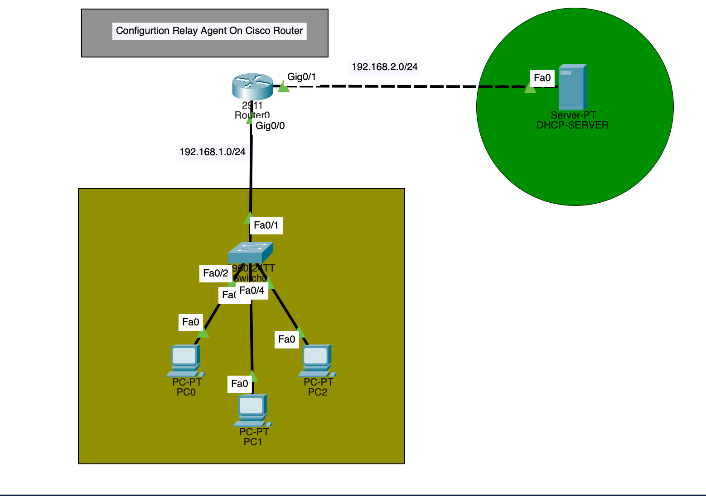

# DHCP Relay Agent Configuration on Cisco Router

## Project Description

This project demonstrates how to configure a Cisco Router as a **DHCP Relay Agent** to allow clients in one subnet to obtain IP addresses from a DHCP server located in a different subnet.

In real enterprise networks, DHCP servers are often centralized. Since routers do not forward broadcast traffic by default, DHCP requests must be relayed using the `ip helper-address` command.

This lab simulates that real-world scenario using Cisco Packet Tracer.

---



## What is DHCP?

**DHCP (Dynamic Host Configuration Protocol)** automatically assigns:

- IP Address
- Subnet Mask
- Default Gateway
- DNS Server

to client devices dynamically.

---

## What is a DHCP Relay Agent?

When a DHCP server is located in a different network, routers block broadcast messages by default.

A DHCP Relay Agent:

- Converts DHCP broadcast requests into unicast
- Forwards them to a remote DHCP server
- Uses the command:

```
ip helper-address <DHCP-Server-IP>
```

In this project:

```
ip helper-address 192.168.2.5
```

---

## Topology

Topology image is available here:

```
docs/topology.png
```

### Network Details

| Device | Interface | IP Address |
|--------|------------|------------|
| Router G0/0 | LAN Side | 192.168.1.1/24 |
| Router G0/1 | Server Side | 192.168.2.1/24 |
| DHCP Server | Fa0 | 192.168.2.5/24 |
| Clients | DHCP | 192.168.1.21+ |

---

## Router Configuration

Configuration file:

```
configurations/router-config.txt
```

---

## DHCP Server Configuration

Configuration file:

```
configurations/dhcp-server-config.txt
```

---

## Packet Tracer File

```
packet-tracer/dhcp-relay-agent.pkt
```

---

## Verification Commands

On Router:

```
show ip interface brief
show running-config
```

On PC:

```
ipconfig
```

---

## Final Outcome

- Clients successfully obtain IP addresses from a remote DHCP server.
- Router relays DHCP broadcasts across networks.
- Demonstrates enterprise-level centralized DHCP design.

---

## Skills Demonstrated

- Cisco Router Configuration
- DHCP Concepts
- DHCP Relay Agent
- IP Addressing & Subnetting
- Network Troubleshooting
- Packet Tracer Lab Implementation
